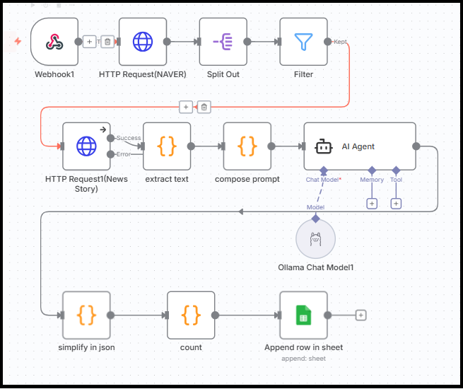
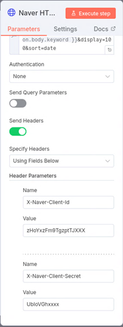
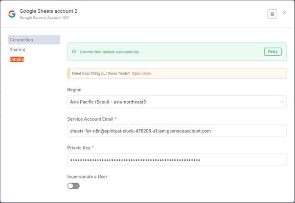
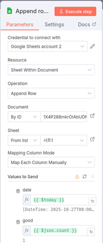
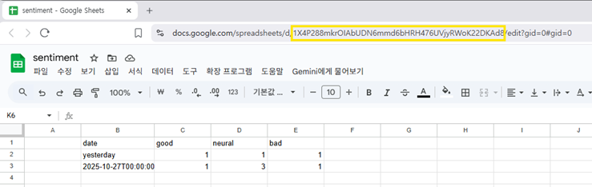

# An n8n example using naver API, web crawling, exaone and google sheet to show the emotion tone of news article about a keyword

n8n를 이용해서 기사 내용을 판별하는 workflow를 작성합니다. 특정 키워드에 대한 기사를 검색하고 기사가 해당 키워드에 대해 긍정, 중립, 부정인지 판별합니다. naver API를 통해 특정 keyword에 관한 뉴스 기사를 검색하고 Filter 노드를 통해서 오늘 날짜 기사만 찾고 HTTP Request1 노드로 기사 전문을 가져옵니다.  

"body" tag에는 키워드 기사 뿐만 아니라 link 정보도 포함되어 있어 혼란스러운데 그래도 n8n에서 제공하는 "Sentiment Analysis"를 chatGPT에 연동하면 "Positive", "Neutral", "Negative" 중에 하나는 선택해서 알려 줍니다. 그러나 parameter 수가 작은 exaone 모델을 사용하면 sentiment를 판단하지 못하는 한계가 있습니다.  해당 키워드를 포함하는 text만 정교하게 추출하게 위하여 "extract text" 노드가 필요합니다. cheerio로 html 태그를 모두 없애고 "\n\n\n\n\n\n\n\n\n\t"과 같은 구분자로 문단을 나눈 다음 키워드를 포함하고 길이가 가장 긴 문단을 찾아 넘겨 줍니다. "compose prompt" 노드에서 직접 prompt를 작성하고 AI agent에서 미리 준비해둔 "exaone chat model"를 호출합니다. exaone 3.5(32b) 모델을 사용하는데 ollama로 구동했습니다.  json 결과를 정리하고 Positive, Neutral 그리고 Negative를 count하는 "simplify in json"과 "count" 노드를 를 거쳐서 Google sheet에 count 수를 기록합니다. "News_sentiment(ollama).json" 파일로 된 workflow을 n8n에서 import하면 아래 화면을 볼 수 있습니다.



 Naver API에는 X-Naver-Client-Id와 X-Naver-Client-Secret를 입력해야 합니다.

 

 그리고 Google sheet 사용을 위한 credential은 service account로 만듭니다.

 

 마지막 google sheet 지정을 위해 ID가 필요한데 URL에서 볼 수 있습니다.

 

 ID는 Document에 "By ID"로 지정하고 구글 드라이브에서 해당 파일의 공유 특성도 "편집자"로 변경해야 "시트1"를 볼 수 있고 편집이 가능합니다.

 

 Webhook1는 아래 명령어로 시작합니다.

```
# curl -d "keyword=LG화학"  -H "Content-Type: application/x-www-form-urlencoded" -X POST http://localhost:5678/webhook-test/4b71a486-e711-4de0-a721-462c92bcc540
```

### n8n environments
```
n8n : 1.118.2
nodejs : v22.21.0
OS: ubuntu 24.04.02
export N8N_SECURE_COOKIE=false
export NODE_FUNCTION_ALLOW_EXTERNAL=cheerio
```
